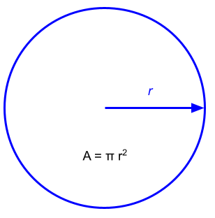
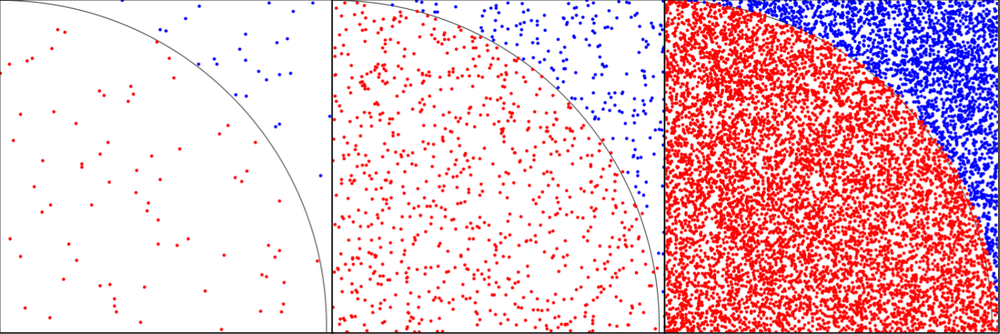
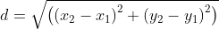
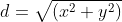
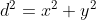

Once you have been introduced to the basics of parallel computing with OpenMP or OpenMPI, a nice first problem to tackle is a parallel Monte Carlo estimation for the value of the mathematical constant *π*.

*(Note: the information in this post is taken from one of the CCLA's [course modules](https://mmeysenburg.github.io/ccla-class-modules/), [Parallel Python](https://mmeysenburg.github.io/ccla-class-modules/2023-10-17-parallel-python/). You will find a sample Python OpenMPI solution to the problem there.)*

The mathematical constant *π* is an *irrational number*, i.e., a real number that cannot be expressed as a ratio of integers. Listing all of the digits after the decimal point in *π* is impossible, since they go on and on infinitely. Therefore, we cannot *calculate* *π*, but only *estimate* its value.

There are a wide variety of different infinite series formulae for estimating *π*, but the approach we will take here uses a *Monte Carlo method*, which means that it relies on randomness.

## Using a circle's area to estimate *π*

Consider the formula for calculating the area of a circle with radius *r*:



If we use one for the radius of our circle, then the area formula simplifies to:

*A = π*.

And, suppose we look at only one quarter of the circle, say, the upper right quadrant. Then, we would have

*A = π / 4*.

We're trying to find an estimate of *π*, so solving for *π* in the last equation gives us:

*π = 4A*.

So, if we have a way to estimate the area of one quadrant of a unit circle, we can multiply that by four and arrive at an estimate of *π*. 

## The Monte Carlo method

To find the area of our circle quadrant, we're going to pretend that the unit square containing the quadrant is a dart board, and throw lots and lots of virtual darts at it! 

Our Monte Carlo method works like this: we'll generate many, many *(x, y)* coordinates, where each *x* and *y* is a randomly chosen number in the range *[0, 1)*. For each coordinate, we will calculate the distance from the origin *(0, 0)* to the point *(x, y)*. If that distance is less than or equal to one, then the point lands inside the unit circle quadrant; if the distance is greater than one, then the point landed outside the circle quadrant. We will count how many of our darts / coordinates were inside the circle, and if we throw enough darts, dividing that number by the total number of darts thrown will give us an estimate of the area of the circle quadrant. 

This image may help you understand the process. The leftmost image shows our dartboard after just a few darts were thrown; those that are inside the circle quadrant are colored red, while those outside the quadrant are blue. The middle image has more darts, and the rightmost image has even more. 



As we have more and more darts, the ratio of red to blue points will be closer and closer to the area of the circle quadrant.

In order to determine if a dart is inside the circle quadrant, we need to calculate its distance from the origin. Generally speaking, the distance between two points *(x<sub>1</sub>, y<sub>1</sub>)* and *(x<sub>2</sub>, y<sub>2</sub>)* can be determined by this formula:



We can simplify things to make the formula simpler and faster to calculate. First, recall that one of our points in this situation is always *(0, 0)*. Let's assume that *(x<sub>1</sub>, y<sub>1</sub>) = (0, 0)*. Now, the subtractions are eliminated, because subtracting zero from any value leaves you with the same value. So, our distance formula is now:



Squaring both sides, we have:



We are interested in the case where *d ≤ 1*. Squaring both sides of that inequality, we have *d<sup>2</sup> ≤ 1<sup>2</sup> = 1*. So, if the Boolean expression `x * x + y * y <= 1.0` is true, our dart was inside the circle quadrant.

## Uni-processor Python solution

Here is a Python function to implement our Monte Carlo method of estimating *π*. 


def monte_pi(n):
    '''
    Use a Monte Carlo method to estimate the value of π.

    parameters
    ----------
    n : integer
      Number of "darts" to throw at a unit circle quadrant.

    returns
    -------
    Estimate of π, as a floating-point number.
    '''
    import random

    num_in = 0
    for i in range(n):
        x = random.random() # random number in [0, 1)
        y = random.random()
        if x * x + y * y <= 1.0:
            num_in += 1
    
    return 4.0 * num_in / n


We use the `for` statement to throw our darts, and the `random.random()` method to get the *(x, y)* value for each dart. Then, we use our simplified distance formula to determine if each dart landed inside the circle quadrant. We use an accumulator pattern to keep track of how many darts landed inside the quadrant. Finally, we return four times our area estimate as our estimate of *π*. 

We called this function for 100, 10,000, and 10,000,000 darts, and as expected, the estimate of *π* gets better as the number of darts increases.

```
Estimate using 100 darts: 3.040000
Estimate using 10000 darts: 3.145600
Estimate using 10000000 darts: 3.141642
```

There is one problem, however. As the number of darts increases, it takes longer and longer for our code to execute.

## Your call to action

Using OpenMP or OpenMPI, parallelize the Monte Carlo estimation of *π*. 
