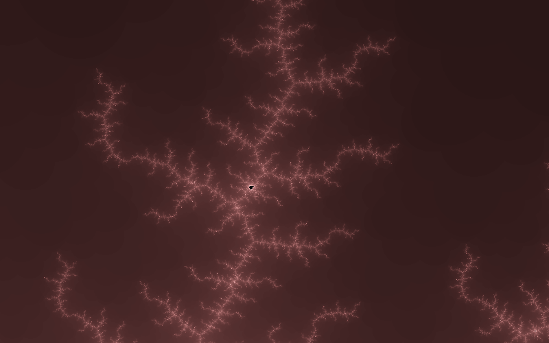
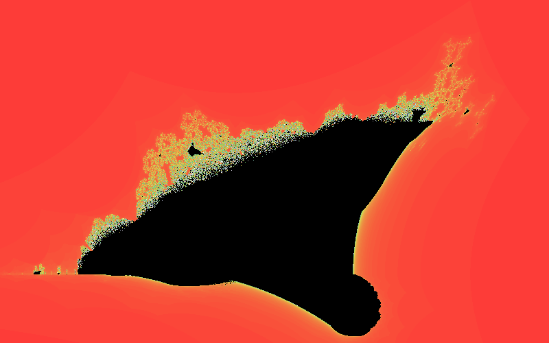
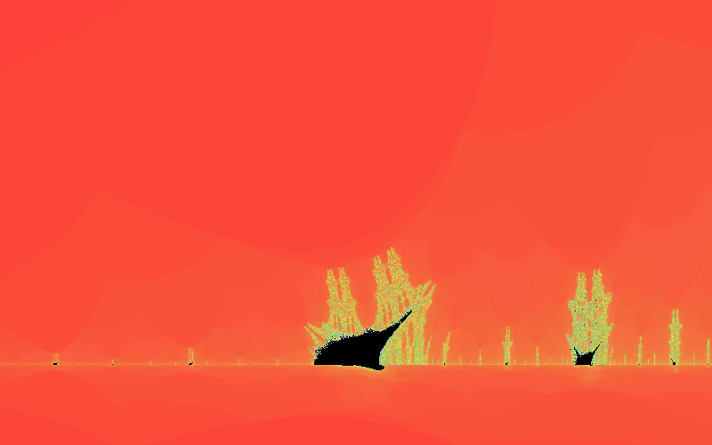
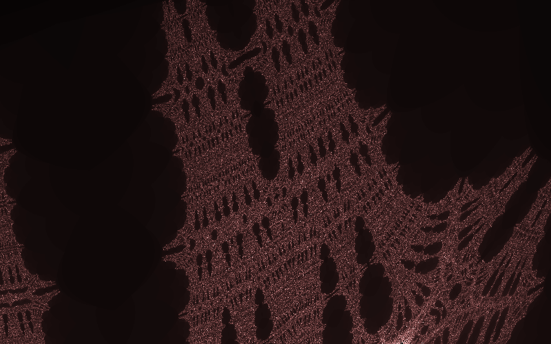
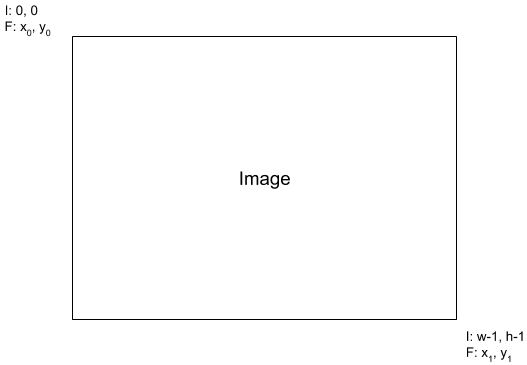

In this project you will create a parallelized Python program to create an image of the *Burning Ship* fractal.

A *fractal*, as defined by Benoit Mandelbrot, is a "a rough or fragmented geometric shape that can be split into parts, each of which is (at least approximately) a reduced-size copy of the whole." Mandelbrot coined the term "fractal" in the 1970s, and one of the most famous fractals is the Mandelbrot set, as shown in the following images.




You will create images of a different fractal, namely, the Burning Ship fractal. Here are several images showing the fractal, with the coordinates of the bounding box for each image.


*(x<sub>0</sub>, y<sub>0</sub>) = (-2, -2); (x<sub>1</sub>, y<sub>1</sub>) = (1.5, 0.5)*


*(x<sub>0</sub>, y<sub>0</sub>) = (-1.974, -0.2465); (x<sub>1</sub>, y<sub>1</sub>) = (-1.553, 0.05411)*


*(x<sub>0</sub>, y<sub>0</sub>) = (-1.768, -0.073); (x<sub>1</sub>, y<sub>1</sub>) = (-1.717, -0.03686)*

The overall idea involved in drawing the fractal is quite simple: for each pixel in the image, your program will calculate the value of some mathematical function. Based on the results of that calculation, you set the color of the pixel. Of course, as they say, the devil is in the details.

## Uniprocessor version

First we will develop an uniprocessor version. One of the issues we have to confront is how to map the *(row, column)* coordinate of a pixel to the *(x, y)* coordinate of a point in the fractal image. Consider this image:



The rectangle represents your image, with coordinates shown for the upper left and lower right pixel. The top line of each coordinate label shows image coordinates, while the lower line of each shows corresponding real numbers for the fractal. For each pixel in the image, we need a way to convert the pixel coordinates to real numbers in the specified real range. For the first Burning Ship fractal image above, the upper left corner is at *x<sub>0</sub>, y<sub>0</sub>) = (-2, -2\right)*, while the lower right corner coordinate is *(x<sub>1</sub>, y<sub>1</sub>) = (1.5, 0.5)*.

Here is a Python function you could use to do this translation:


def mapToRange(val, valLo, valHi, outLo, outHi):
    '''
    Map a value from the range [valLo, valHi] to [outLo, outHi].

    parameters
    ----------
      val - Value to map
      valLo - Lowest value val could have
      valHi - Highest value val could have
      outLo - Lowest value output could have
      outHi - Higest value output could have

    returns
    -------
      val mapped onto the range [outLo, outHi]

    return outLo + ((outHi - outLo) / (valHi - valLo)) * (val - valLo)


If the pixel you are currently processing is at `(row, col)`, and the height of your image is `h` pixels, then the function call

```
y = mapToRange(row, 0, h - 1, -2, 1.5)
```

would map the image pixel `row` value to the correct fractal *y* coordinate. 

For each point in the image, we test to see if the point is in the Burning Ship fractal set via this function:


def testPoint(x, y):
    '''
    Test a point to see if it belongs to the Burning Ship set or not.

    parameters
    ----------
      x - x coordinate to test
      y - y coordinate to test

    returns
    -------
      Number of iterations in the testing loop before the 
      value "blows up," as a value in [0, 255]
    '''
    i = 0
    zx = x
    zy = y 

    while (zx * zx  + zy * zy) < 4 and i < 255:
        xT = zx * zx - zy * zy + x
        zy = abs(2 * zx * zy) + y
        zx = xT
        i += 1

    return i


This function returns a number in *[0, 255]*. A value of 255 means the point is in part of the "ship" in the Burning Ship fractal, while values less than 255 represent some degree of closeness to being in the set. We will use the return value of the `testPoint()` function to set the red, green, and blue values for each point in the output image. 

Now we can finish the code for our uniprocessor Burning Ship fractal maker:


'''
 ' Main program starts here.
'''
# save command-line arguments
w = int(sys.argv[1])
h = int(sys.argv[2])
x0 = float(sys.argv[3])
y0 = float(sys.argv[4])
x1 = float(sys.argv[5])
y1 = float(sys.argv[6])
fileName = sys.argv[7]

# create a black, w x h pixel, RBG image
image = np.zeros((h, w, 3), dtype = 'uint8')

# iterate over each pixel
for row in range(h):
    for col in range(w):
        # map pixel row, col to image x, y
        x = mapToRange(col, 0, w - 1, x0, x1)
        y = mapToRange(row, 0, h - 1, y0, y1)

        # test the point to see if it's in the Burning Ship set
        c = testPoint(x, y)

        # use the testPoint value to make a grayscale pixel
        image[row][col] = [c, c, c]

# Now we can output the image!
imageio.imwrite(fileName, image)


We read the parameters for the fractal from the command-line, create a black image of the appropriate dimensions, and then use nested for loops to iterate over each pixel in the image. For each pixel, we test to see if it is in the Burning Ship fractal set, and then use the return value to set the gray scale color of the pixel. Finally, we use the `imageio` module's `imwrite()` function to write our image out to disk. 

## Your call to action

Now, take the uniprocessor code we developed above and parallelize it using OpenMPI. A hint is to "stripe" the image, and have each sub-processor work on a stripe. In this approach, the root processor would send the image dimensions and bounding box of the fractal to each sub-processor, along with the width of a vertical "stripe" of the fractal for the sub-processor to compute. Then, each sub-processor only works on a smaller portion of the fractal. This image shows the striping that could be used, with eight processors. The root processor is responsible for collecting the parameters, determining the stripe size, and writing the final image; the seven remaining processors each calculate one stripe of the fractal.


